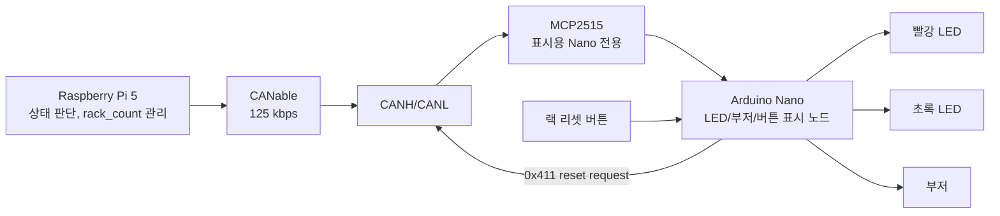

# LED + 부저

이 폴더는 **별도 Arduino Nano + MCP2515 + 빨강 LED + 초록 LED + 부저 + 랙 리셋 버튼**으로 CNC/랙 상태를 표시하는 버전입니다.

중요합니다. 이 Nano는 라즈베리파이 안에서 현재 TOF나 기존 로봇 제어에 쓰는 Nano가 아닙니다. 기존 TOF용 Nano, STS3215/URT 제어 Nano, 라즈베리파이 파일은 건드리지 않고, 새 표시 전용 Nano를 CAN 버스에 하나 더 붙이는 구상입니다.

```text
Raspberry Pi = 상태 판단, rack_count 관리, CNC 20초 타이머 관리
표시용 Nano = CAN 수신, LED/부저 표시, 리셋 버튼 요청 송신
```

Nano는 판단하지 않습니다. Nano가 직접 `rack_count = 0`으로 바꾸지도 않습니다. 리셋 버튼이 눌리면 Nano는 RPi로 `0x411` 요청만 보내고, RPi가 로봇이 바쁘지 않은지 확인한 뒤 랙 카운트를 초기화합니다.

## 포함 파일

| 경로 | 용도 |
|---|---|
| `rpi/cnc_status_buzzer.py` | RPi 쪽 상태 계산, `0x410` 송신, `0x411` 리셋 요청 파싱 헬퍼 |
| `arduino/nano_cnc_status_buzzer_node/nano_cnc_status_buzzer_node.ino` | 별도 표시용 Nano에 올릴 MCP2515/LED/부저/리셋 버튼 스케치 |
| `docs/can_status_frame.md` | CAN ID, payload, 상태 번호, `cansend` 테스트 명령 |
| `docs/wiring.md` | 표시용 Nano 기준 배선, 부저 구동, 전원/GND/CAN 종단 주의 |

## 전체 흐름

Raspberry Pi 5는 카메라와 AI로 작업 상태를 판단하고 CANable을 통해 CAN 명령을 보냅니다. 별도 표시용 Arduino Nano는 MCP2515로 CAN ID `0x410` 상태 프레임을 받아 LED와 부저만 출력하고, 리셋 버튼이 눌리면 CAN ID `0x411`로 요청만 보냅니다.



## 상태는 5개만 사용

| 번호 | 상태 | 빨강 LED | 초록 LED | 부저 | 의미 |
|---|---|---|---|---|---|
| `0` | `IDLE` | OFF | ON | OFF | CNC 비어 있음 |
| `1` | `MACHINING` | ON | OFF | OFF | CNC 가공 중 |
| `2` | `DONE_WAIT` | OFF | 느린 점멸 | OFF | 가공 완료, 로봇 회수 대기 |
| `3` | `RACK_FULL` | 빠른 점멸 | OFF | 짧게 두 번 반복 | 랙 만재, 작업자 조치 필요 |
| `4` | `ERROR` | 빠른 점멸 | 빠른 점멸 | 빠른 점멸 | 오류 |
| `255` | `CAN_LOST` | 느린 교차 | 느린 교차 | OFF | RPi 상태 프레임 끊김 |

작업자 설명은 이렇게 짧게 가져가면 됩니다.

```text
초록 고정 = CNC 비어 있음
빨강 고정 = CNC 가공 중
초록 깜빡임 = 가공 완료, 회수 대기
빨강 깜빡임 + 부저 = 랙 만재
빨강/초록/부저 빠름 = 오류
빨강/초록 느린 교차 = RPi 통신 끊김
```

## CAN 프레임

RPi에서 표시용 Nano로 보내는 상태:

```text
CAN ID: 0x410
DLC: 8
byte[0] = 0x20
byte[1] = state
byte[2] = rack_count
byte[3] = rack_capacity
byte[4] = remaining_sec
byte[5] = flags
byte[6] = seq
byte[7] = reserved
```

표시용 Nano에서 RPi로 보내는 랙 리셋 요청:

```text
CAN ID: 0x411
DLC: 8
byte[0] = 0x31
byte[1] = 1
byte[2] = seq
byte[3..7] = 0
```

자세한 값과 테스트 명령은 `docs/can_status_frame.md`에 정리했습니다.

## RPi 적용 방법

`rpi/cnc_status_buzzer.py`는 현재 운영 중인 대시보드 브리지나 auto workflow 근처에 복사해서 쓰는 헬퍼입니다. 실제 CAN bus를 이미 열고 있는 프로세스에서 import하는 방식을 권장합니다.

```python
from cnc_status_buzzer import (
    CncStatusCanNode,
    calc_cnc_status,
    remaining_cnc_seconds,
)

status_node = CncStatusCanNode(bus)

state = calc_cnc_status(
    now=now,
    cnc_busy=cnc_busy,
    cnc_start=cnc_start,
    rack_count=rack_count,
    rack_capacity=2,
    error=has_error,
)

status_node.send_status_if_due(
    state,
    rack_count=rack_count,
    rack_capacity=2,
    remaining_sec=remaining_cnc_seconds(
        now=now,
        cnc_busy=cnc_busy,
        cnc_start=cnc_start,
    ),
)
```

CAN 수신 루프에서 `0x411` 리셋 요청을 처리합니다.

```python
if status_node.handle_reset_frame(msg):
    requested = status_node.pop_reset_request(robot_busy=robot_busy)
    if requested:
        rack_count = 0
```

`robot_busy == True`이면 리셋을 무시하는 쪽이 안전합니다. 버튼 하나 때문에 실제 로봇 상태와 랙 카운트가 어긋나면 이후 자동 운전이 위험해집니다.

## RPi 테스트

CAN 없이 프레임만 확인:

```bash
python3 "LED + 부저/rpi/cnc_status_buzzer.py" --dry-run --state RACK_FULL --rack-count 2 --rack-capacity 2 --once
```

실제 `can0`로 상태 순환 테스트:

```bash
python3 "LED + 부저/rpi/cnc_status_buzzer.py" --interface can0 --cycle
```

리셋 요청 수신 확인:

```bash
python3 "LED + 부저/rpi/cnc_status_buzzer.py" --interface can0 --listen-reset
```

## Arduino 적용 방법

1. 새 표시 전용 Arduino Nano를 준비합니다. 기존 TOF용 Nano에 업로드하지 않습니다.
2. MCP2515 모듈을 표시용 Nano에 연결합니다.
3. Arduino IDE에서 `arduino/nano_cnc_status_buzzer_node/nano_cnc_status_buzzer_node.ino`를 엽니다.
4. `MCP_CAN_lib` 라이브러리를 설치합니다.
5. MCP2515 모듈 크리스털이 8MHz면 기본값 그대로, 16MHz면 `MCP_CLOCK`을 `MCP_16MHZ`로 바꿉니다. 사양 확인 필요.
6. 부저가 능동형인지 수동형인지 확인합니다. 기본 코드는 능동형 부저 기준입니다. 수동형이면 `PASSIVE_BUZZER`를 `1`로 바꿉니다. 사양 확인 필요.
7. 업로드 후 RPi에서 `--cycle` 테스트를 실행합니다.

기본 핀:

```text
D4 = 빨강 LED
D5 = 초록 LED
D6 = 부저
D7 = 랙 리셋 버튼
D10/D11/D12/D13/D2 = MCP2515
```

## 랙 만재와 리셋 정책

`RACK_FULL`은 LED/부저만 울리고 끝내면 안 됩니다. RPi 로직에서 다음을 막아야 합니다.

```text
rack_count >= rack_capacity:
  - 새 PIPE를 CNC에 투입 금지
  - CNC 완료품 회수 금지 또는 대기
  - 작업자가 랙을 비운 뒤 표시용 Nano 리셋 버튼 누름
  - RPi가 robot_busy == False일 때만 rack_count = 0 처리
```

부저는 작업자를 부르는 알림일 뿐이고, 안전 조건은 RPi 로직과 물리 E-Stop이 담당합니다.

## 안전 주의

- 이 Nano는 표시 전용입니다. STS3215/URT, TOF, E-Stop 물리 차단을 대신하지 않습니다.
- E-Stop은 반드시 STS3215 +7.4~+7.5V 서보 전원을 물리적으로 차단해야 합니다.
- STS3215 전원은 Arduino 5V, Raspberry Pi 5V, CANable 5V OUT에서 공급하지 않습니다.
- Raspberry Pi 5는 전용 USB-C 5V 어댑터를 사용합니다.
- 표시용 Nano, MCP2515, CANable terminal GND는 공통 GND로 묶는 것을 권장합니다.
- 12V/24V 부저나 패널 램프는 Nano 핀에 직접 연결하지 말고 트랜지스터, MOSFET, 포토커플러, 릴레이 드라이버를 사용해야 합니다. 사양 확인 필요.
- `LED 버전` 폴더와 `LED + 부저` 폴더는 서로 다른 대안입니다. 둘 다 같은 `0x410`을 쓰지만 상태 번호 체계가 다르므로 동시에 같은 CAN 버스에서 운용하지 마십시오.
