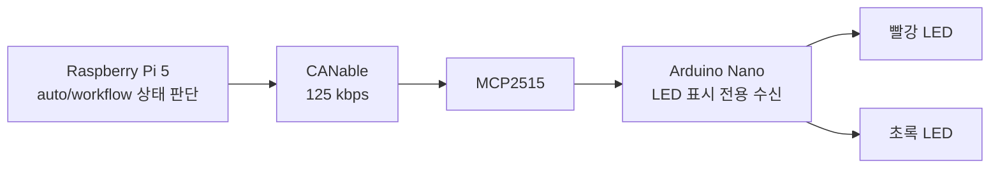

# LED 버전

부저 없이 빨강 LED와 초록 LED 두 개만으로 CNC/랙 상태를 작업자가 바로 구분할 수 있게 만든 버전입니다. 원칙은 단순합니다.

```text
Raspberry Pi가 상태를 판단한다.
CAN ID 0x410으로 Arduino Nano에 상태만 보낸다.
Arduino Nano는 LED 패턴만 표시한다.
```

Nano가 CNC 타이머나 랙 개수를 추론하지 않습니다. 로봇 동작 차단, 랙 만재 판단, 리셋 처리는 Raspberry Pi 쪽 로직이 담당해야 합니다.

## 포함 파일

| 경로 | 용도 |
|---|---|
| `rpi/cnc_led_state.py` | RPi에서 LED 상태 계산, CAN 프레임 생성, 5Hz 송신, 테스트 송신까지 담당하는 Python 헬퍼 |
| `arduino/cnc_led_status_nano/cnc_led_status_nano.ino` | MCP2515로 CAN ID `0x410`을 받아 빨강/초록 LED 패턴을 출력하는 Nano 스케치 |
| `arduino/merge_into_existing_firmware.md` | 기존 STS3215/TOF/E-Stop Nano 펌웨어에 LED 수신부만 병합하는 방법 |
| `docs/can_led_frame.md` | CAN 프레임 ID, DLC, byte 의미, 상태 번호 정리 |
| `docs/wiring.md` | Nano, MCP2515, LED 배선과 하드웨어 주의사항 |

## 전체 흐름

Raspberry Pi 5는 카메라와 AI로 동작을 판단하고, CANable을 통해 CAN 명령을 보내며, Arduino Nano는 MCP2515로 CAN을 받아 URT/UART 경로로 STS3215 6축 서보를 제어하고, STS3215 엔코더 피드백과 E-Stop/리미트/TOF 상태를 CAN으로 Raspberry Pi에 보고합니다.

이 LED 버전은 그 구조에 상태 표시 전용 CAN 프레임 하나를 추가합니다.



## LED 패턴

| 상태 | 빨강 LED | 초록 LED | 작업자 의미 |
|---|---|---|---|
| `IDLE` | OFF | ON | CNC 비어 있음, 투입 가능 |
| `LOADING` | 빠른 교차 점멸 | 빠른 교차 점멸 | 로봇이 CNC에 소재를 넣는 중 |
| `MACHINING` | ON | OFF | CNC 가공 중 |
| `DONE_WAIT_UNLOAD` | OFF | 느린 점멸 | 가공 완료, 회수 대기 |
| `UNLOADING` | 빠른 교차 점멸 | 빠른 교차 점멸 | 로봇이 CNC에서 제품을 꺼내는 중 |
| `RACK_FULL` | 두 번 점멸 반복 | OFF | 랙 만재, 작업자 조치 필요 |
| `ERROR` | 빠른 동시 점멸 | 빠른 동시 점멸 | 오류 |
| `CAN_LOST` | 느린 교차 점멸 | 느린 교차 점멸 | RPi 상태 프레임 수신 끊김 |

작업자에게는 이렇게 설명하면 됩니다.

```text
초록 고정 = CNC 대기
빨강 고정 = CNC 가공 중
초록 깜빡임 = 가공 완료, 회수 대기
빨강 두 번 깜빡임 = 랙 만재
빨강/초록 빠른 교차 = 로봇이 넣거나 꺼내는 중
빨강/초록 동시 빠른 깜빡임 = 오류
빨강/초록 느린 교차 = 통신 끊김
```

## CAN 프레임

```text
CAN ID: 0x410
Frame: Standard 11-bit
DLC: 8
Rate: RPi에서 5Hz 반복 송신 권장
```

| Byte | 의미 |
|---|---|
| `0` | 명령 타입, 고정값 `0x20` |
| `1` | LED 상태 번호 |
| `2` | `rack_count` |
| `3` | `rack_capacity` |
| `4` | CNC 남은 시간, 초 단위, 0~255 |
| `5` | flags, 현재 0 |
| `6` | sequence counter, 0~255 반복 |
| `7` | reserved, 현재 0 |

상태 번호는 `docs/can_led_frame.md`와 `rpi/cnc_led_state.py`의 `CncLedState`를 기준으로 맞춥니다.

## RPi 적용 방법

1. `rpi/cnc_led_state.py`를 Raspberry Pi의 대시보드/브리지 코드 근처에 복사합니다.
2. `rpi_dashboard_ws_bridge.py`처럼 CAN bus를 이미 소유한 프로세스에서 import합니다.
3. 메인 루프에서 5Hz로 `send_if_due()`를 호출합니다.
4. `auto_runner`가 직접 CAN을 열지 않게 하고, 브리지가 LED 상태 송신을 담당하게 두는 편이 안전합니다.

예시:

```python
from cnc_led_state import (
    CncLedCanPublisher,
    calc_cnc_led_state,
    remaining_cnc_seconds,
)

led_publisher = CncLedCanPublisher(bus)

state = calc_cnc_led_state(
    now=now,
    cnc_busy=cnc_busy,
    cnc_start=cnc_start,
    rack_count=rack_count,
    rack_capacity=2,
    motion_phase=motion_phase,
    error=has_error,
)

led_publisher.send_if_due(
    state,
    rack_count=rack_count,
    rack_capacity=2,
    remaining_sec=remaining_cnc_seconds(
        now=now,
        cnc_busy=cnc_busy,
        cnc_start=cnc_start,
    ),
)
```

중요한 점은 `sleep(20)`으로 CNC 가공 시간을 막아두면 안 된다는 것입니다. CNC가 가공 중일 때도 로봇은 볼트/너트 작업을 계속할 수 있어야 하므로, `cnc_start`와 현재 시간을 비교해서 상태만 계산해야 합니다.

## RPi 테스트 송신

CAN 없이 프레임만 확인:

```bash
python3 "LED 버전/rpi/cnc_led_state.py" --dry-run --state IDLE
```

실제 `can0`로 한 상태 송신:

```bash
python3 "LED 버전/rpi/cnc_led_state.py" --interface can0 --state MACHINING --once
```

LED 패턴 순환 테스트:

```bash
python3 "LED 버전/rpi/cnc_led_state.py" --interface can0 --cycle
```

## Arduino 적용 방법

`cnc_led_status_nano.ino`는 LED 수신부를 단독으로 검증하기 위한 스케치입니다. 실제 로봇을 제어하는 같은 Nano에 그대로 덮어쓰면 STS3215, TOF, E-Stop 처리가 멈출 수 있습니다.

1. 먼저 별도 Nano나 테스트 환경에서 `arduino/cnc_led_status_nano/cnc_led_status_nano.ino`를 열어 LED/CAN 표시만 확인합니다.
2. MCP2515 라이브러리인 `MCP_CAN_lib`를 설치합니다.
3. 보드는 Arduino Nano, 프로세서는 사용하는 Nano에 맞게 선택합니다.
4. MCP2515 모듈의 크리스털이 8MHz면 기본값 그대로 둡니다. 16MHz 모듈이면 코드의 `MCP_CLOCK`을 `MCP_16MHZ`로 바꿉니다. 사양 확인 필요.
5. 업로드 후 RPi에서 `--cycle` 테스트를 실행합니다.
6. 실장 Nano가 서보 제어까지 담당한다면 `arduino/merge_into_existing_firmware.md` 절차대로 기존 펌웨어에 LED 함수만 병합합니다.

기본 LED 핀은 A0/A1입니다.

```text
A0 = 빨강 LED
A1 = 초록 LED
```

첨부 원안처럼 D4/D5를 쓰고 싶으면 `.ino`에서 아래 값을 `1`로 바꾸면 됩니다.

```cpp
#define USE_D4_D5_LED_PINS 1
```

다만 D4~D9는 리미트 스위치 확장 후보 핀이므로, 최종 배선에서는 A0/A1 기본값을 권장합니다.

## 랙 만재 로직

LED는 알림일 뿐입니다. `rack_count >= rack_capacity`이면 RPi 로봇 로직에서 다음 동작을 막아야 합니다.

```text
rack_count >= rack_capacity:
  - 새 소재 CNC 투입 금지
  - CNC 완료품 회수 금지 또는 대기
  - 대시보드에서 랙 비우기/리셋 안내
  - LED는 RACK_FULL 표시
```

랙 카운트 리셋은 Nano 버튼이 아니라 RPi 대시보드나 운영 명령에서 처리하는 편이 맞습니다. Nano는 실제 랙이 비워졌는지 알 수 없기 때문입니다.

## 안전 주의

- E-Stop은 반드시 STS3215 서보 +7.4~+7.5V 전원을 물리적으로 차단해야 합니다. LED나 소프트웨어 정지만으로 대체하면 안 됩니다.
- STS3215 전원은 Arduino 5V, Raspberry Pi 5V, CANable 5V OUT에서 공급하지 않습니다.
- Raspberry Pi 5는 전용 USB-C 5V 어댑터를 사용합니다.
- SMPS GND, Arduino GND, MCP2515 GND, URT GND, STS3215 GND, VL53L1X GND, CANable terminal GND는 공통 GND로 묶는 것을 권장합니다.
- LED가 12V/24V 패널 LED이거나 소비 전류가 큰 표시등이면 Nano 핀에 직접 연결하지 말고 트랜지스터, MOSFET, 포토커플러, 릴레이 드라이버를 사용해야 합니다. 사양 확인 필요.
- CAN 종단저항은 버스 양 끝에만 120옴을 둡니다. CANable과 MCP2515 모듈의 종단 상태는 사양 확인 필요.
